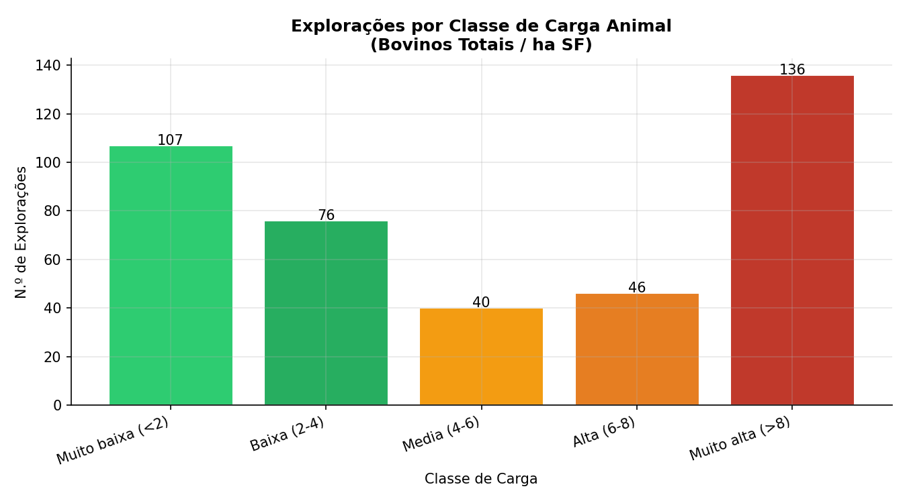
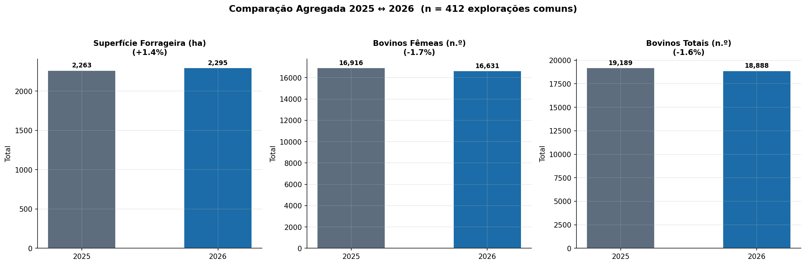
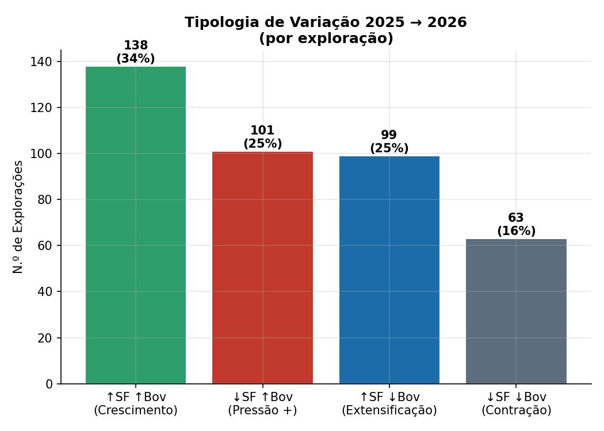
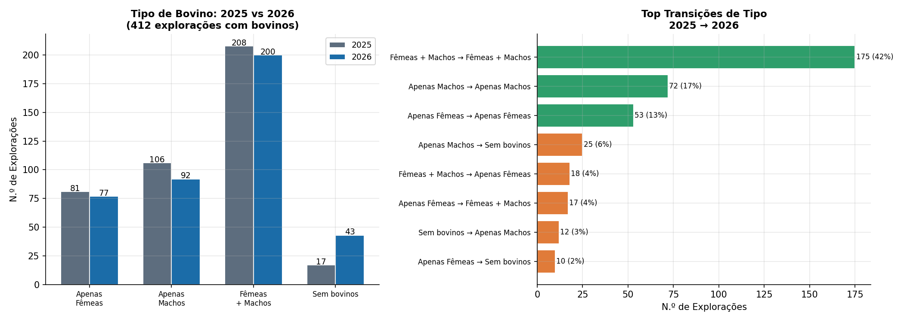

# Livestock stocking rates in a Nitrates Vulnerable Zone
### Forage surface × bovine numbers, with year-on-year comparison · Esposende – Vila do Conde Vulnerable Zone, Portugal

> Computing per-holding stocking rates (bovines per hectare of forage
> surface) by joining the land-parcel registry with the zone's livestock
> records — and tracking their evolution between campaigns, holding by
> holding. The animal-pressure side of the nitrate equation.

---

*A U-shaped distribution: very low (<2) and very high (>8 head/ha SF) classes dominate — two production models coexist in the zone, land-based and quasi-landless intensive.*

*Aggregate change on the 412 common holdings with cattle: forage surface up 1.4 %, herd down 1.6 % — a slight extensification in the aggregate.*

*The same change, holding by holding: growth (34 %) and contraction (16 %) coexist with opposite-direction movements — aggregate stability conceals strong individual dynamics.*

*Herd composition 2025 → 2026: most holdings keep their type (72 % on the diagonal), but note the exits — holdings without cattle rose from 17 to 43.*

## Why stocking rates matter here

Dairy cattle farming has a major presence in the Esposende – Vila do Conde
Vulnerable Zone and is widely perceived as a threat to its environmental
sustainability. Tracking the evolution of the bovine herd and of the
**forage surface** (SF) that supports it is therefore central to the
monitoring programme.

The stocking rate takes on particular weight in a Vulnerable Zone because
of the nitrogen restrictions applicable to agricultural parcels under the
Nitrates Directive Action Programme: a ceiling of **250 kg of total
nitrogen per hectare per year**, of which no more than **170 kg N/ha/year
may come from livestock effluents**. The ratio of animals to forage
hectares is the first-order proxy for that manure-nitrogen pressure — and,
combined with the nitrate concentration series, it is what allows
contamination to be read against its potential causes.

This analysis builds directly on the
[farm-holdings baseline](https://github.com/LFilipePacheco/farm-holdings-integration):
the integrated, spatially anchored universe of holdings provides the
denominator (who exists, where, with how much forage surface) to which the
livestock numbers attach.

## The problem

Stocking rates cannot be read off any single source:

- **Forage surface** lives in the land-parcel registry (iSIP sub-parcels
  with land-cover classes), and must be computed per holding from an
  explicit list of forage categories;
- **Bovine numbers** live in the zone's monitoring database (Access),
  split across holdings and livestock tables keyed by taxpayer number
  (NIF);
- The **NIF is stored differently in every source** — numeric in one,
  text in another, sometimes with stray characters — making naïve joins
  silently drop holdings;
- Comparing campaigns (2025 ↔ 2026) requires restricting the analysis to
  the **common universe** of holdings present in both years, or apparent
  change is just churn in the registries.

## The solution

A single pipeline (`stocking_rate_analysis.py`) that:

**1. Computes SF and SA per holding from sub-parcels** — forage surface as
the sum of sub-parcel areas whose land-cover class belongs to an explicit,
auditable forage list (temporary crops, permanent and shrub pasture
classes); total agricultural surface alongside, for context. The category
list is versioned with the code — the methodology is the list.

**2. Normalises the NIF across sources** — a dedicated normalisation
function (strip, digit-validation, type coercion) applied to every source
before any join, closing the classic silent-loss failure mode of
identifier joins.

**3. Reads the livestock database safely** — Access tables via `pyodbc`
in **read-only mode**, with field auto-detection, joining holdings and
bovine counts (females/males) by normalised NIF.

**4. Characterises the current campaign** — per-holding stocking ratios
(bovines per ha SF), computed **only where they make sense** (holdings
with cattle *and* SF > 0), reported with mean, median and maximum — the
median deliberately alongside the mean, since the distribution is heavily
right-skewed by quasi-landless intensive holdings.

**5. Compares campaigns on the common universe** — holdings present in
both 2025 and 2026 (matched by NIF), with aggregate deltas, per-holding
direction-of-change counts (up / down / stable), and a cross-check between
two independent SF computations.

**6. Outputs for every audience** — GeoPackage layer (holding seats with
SF, SA and herd attributes) for GIS; charts; and a formatted Word report
generated end-to-end.

## Results (2026 campaign, aggregate)

| Indicator | Value |
|---|---|
| Holdings analysed | 3,363 — of which **434 with cattle** (405 with cattle and SF > 0) |
| Forage surface (all holdings) | **5,005 ha** (91.5 % temporary forage crops) |
| Bovines | **19,439** (17,044 females · 2,395 males) |
| Stocking (holdings with cattle & SF) | mean 9.8 · median 5.0 head/ha SF |

Year-on-year, on the **412 common holdings with cattle**: forage surface
+1.4 %, total bovines −1.6 %, aggregate stocking rate (ΣBov/ΣSF) down from
8.48 to 8.23 head/ha (**−3.0 %**) — a slight extensification, with
per-holding movements almost perfectly balanced (186 holdings up, 193
down). One year is weather, not trend — but the method is now in place to
tell the difference as campaigns accumulate.

## Why it matters

- **The pressure side of the equation** — with holdings, surface and now
  herd/stocking tracked by a fixed method, nitrate concentrations can be
  confronted with their potential drivers over time;
- **A per-holding lens** — aggregate stability can hide strong individual
  movements; the direction-of-change analysis keeps both visible;
- **Honest statistics** — median reported with mean throughout, and
  ratios computed only where denominators are meaningful;
- **Method over snapshot** — the interannual comparison is restricted to
  the common universe, so measured change is real change, not registry
  churn.

## Repository contents

| File | Purpose |
|---|---|
| `stocking_rate_analysis.py` | Full pipeline: SF/SA computation, NIF normalisation, Access ingestion, per-holding ratios, 2025↔2026 comparison, GeoPackage/chart/report outputs |
| `requirements.txt` | Python dependencies |

Paths and table names are placeholders — point them at your own registry
geodatabase and monitoring database.

## Stack

Python · pandas · GeoPandas · pyodbc (MS Access, read-only) · matplotlib ·
python-docx · GeoPackage

## About the data

The land-parcel registry, the livestock database and all holding-level
results are institutional data of CCDR-Norte, I.P. and are not published
here. Figures above are aggregate statistics from the 2026 analysis. The
code is shared as a working reference implementation.

**Related projects:**
[farm-holdings baseline](https://github.com/LFilipePacheco/farm-holdings-integration) ·
[nitrate monitoring pipeline](https://github.com/LFilipePacheco/monitorizacao-nitratos-zv) ·
[greenhouse detection (U-Net)](https://github.com/LFilipePacheco/greenhouse-detection-unet) ·
[greenhouse registry verification](https://github.com/LFilipePacheco/greenhouse-registry-verification)

---

**Luís Filipe Pacheco** — Senior Agricultural Engineer & Data Scientist,
CCDR-Norte, I.P. · [GitHub profile](https://github.com/LFilipePacheco) ·
[LinkedIn](https://www.linkedin.com/in/lu%C3%ADs-filipe-pacheco-471495b/) ·
[ORCID](https://orcid.org/0009-0001-7676-6542)
